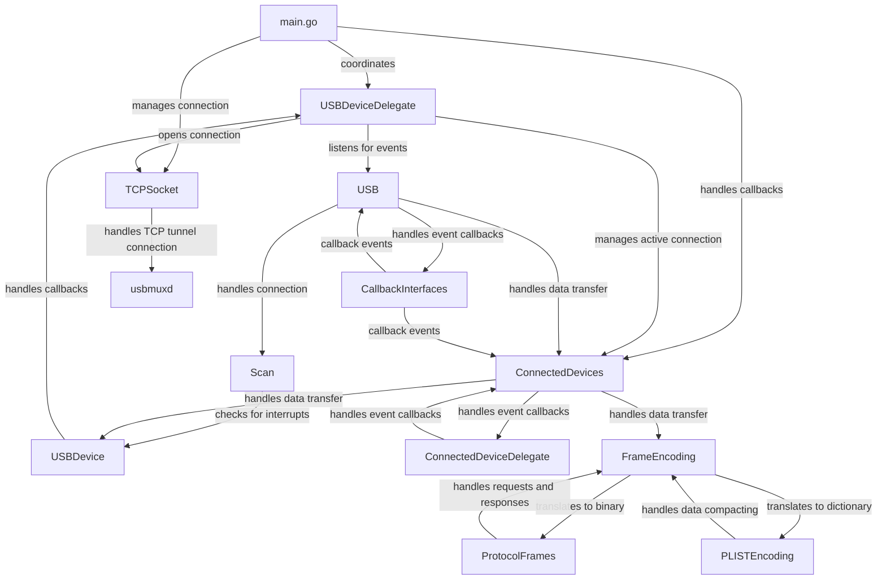

# Overview

This project enables communicating with an iOS device like an iPhone or iPad over USB using the `usbmuxd` daemon on the device. It allows detecting device connections/disconnections, connecting to a TCP port on the device, and sending/receiving data.

The key components are:

* USB device scanning and connection handling
* TCP socket communication
* Parsing protocol frames for sending requests and handling responses
* Callback interfaces for event handling

## Main Packages

**main.go**: The main module coordinates scanning for devices, connecting to them, and handling callbacks.

* The `USBDeviceDelegate` struct implements callback methods for USB events.
* `USB.Listen()` is used to listen for device attach/detach events.
* `USB.ConnectedDevices` manages the active USB connection.
* A TCP socket connection is opened to `usbmuxd` for communication.

**USB/** - Contains code for USB device management

* `Scan` periodically tries connecting to USB devices until successful.
* `ConnectedDevices` represents an active USB connection for sending/receiving data.
* Callback interfaces like `ConnectedDeviceDelegate` handle events.

**frames/** - Defines structures for protocol frames and PLIST encoding

* USB request frames like `USBListenRequestFrame`
* Response frames like `USBGenericACKFrame`
* Attach/detach notice frames like `USBDeviceAttachedDetachedFrame`

**transmission/** - Manages the TCP tunnel connection to `usbmuxd`

## Device Scanning

The `Scan` struct periodically tries connecting to a USB device whenever it is plugged in. It runs in a goroutine checking for interrupts.

When a device is attached, the `USBDeviceDidPlug` callback is invoked, which starts a scan. The scan tries connecting every second until successful.

On success, the `USBDeviceDidSuccessfullyConnect` callback is called. On failure, `USBDeviceDidFailToConnect` is called, and scanning is restarted.

## Sending and Receiving Data

Once connected, the `ConnectedDevices` instance can be used to send and receive data.

Data is sent by constructing a header with metadata like the message tag, followed by the payload data. This is then written to the USB TCP socket.

Received data is parsed by checking the header fields, extracting the tag and payload, and passing it to the `USBDeviceDidReceiveData` callback.

The connection is closed when the socket returns EOF, invoking the `USBDeviceDidDisconnect` callback to restart scanning.

## Frame Encoding

Frames are encoded using the PLIST binary format. This allows sending dictionary structures over the protocol while keeping them compact.

The frame types define the expected keys and data types used in requests and responses. They are serialized to binary when sending and deserialized when receiving.

## Event Handling

The `USBDeviceDelegate` implements callback methods for various USB events and data. These handle the core logic in response to device lifecycle and I/O.

Other delegates like `ConnectedDeviceDelegate` handle events related to an active USB connection.

Callbacks are invoked by the `USB` and `ConnectedDevices` instances to notify consumers of state changes and data. This separation of concerns keeps the code modular and extensible.

## Conclusion

This covers the major components and flow for communicating with iOS devices over USB in Go using the `usbmuxd` protocol. The project shows how to integrate device management, network I/O, protocol encoding, and concurrent event handling to build a robust USB client.
